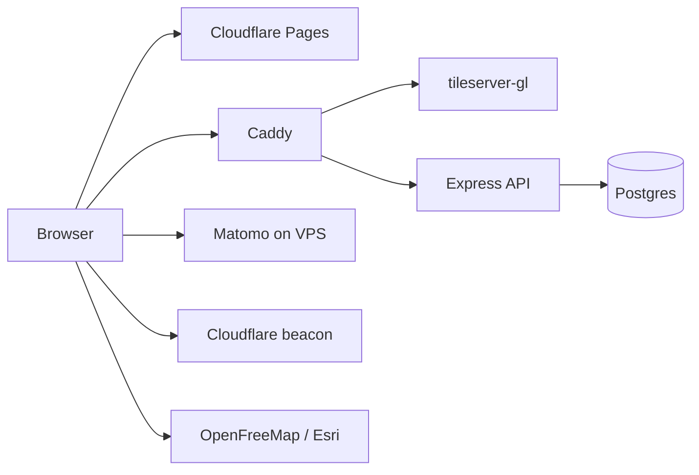

# Security overview (OpenBikeMap)

OWASP-inspired threat model and risk summary for the OpenBikeMap stack. This is **not** a penetration test report — use it to prioritize hardening work before and during beta.

**Related checklists:** [SECURITY-CHECKLIST.md](SECURITY-CHECKLIST.md) (action items), [DEPLOY-VPS.md](DEPLOY-VPS.md) (infra), [ANALYTICS.md](ANALYTICS.md) (privacy).

---

## Scope and assumptions

| Component | Attack surface | Auth |
|-----------|----------------|------|
| **openbikemap.org** (SPA on Cloudflare Pages) | Browser, `localStorage`, third-party scripts | None |
| **api.openbikemap.org** | Public GET API + Postgres | None |
| **tiles.openbikemap.org** | Static MVT + MapLibre styles | None |
| **VPS** (Hetzner) | SSH, Docker, Caddy, data files, Matomo | Root + `.env` |

**Design assumption:** Map data is **intentionally public** (like OpenStreetMap). Security goals are **availability**, **infrastructure integrity**, and **user privacy** — not hiding individual trail or route IDs.

---

## Architecture (trust boundaries)

- **Public internet:** frontend, tiles, API (via Caddy + Cloudflare).
- **Private:** Postgres (Docker network only), API bound to `127.0.0.1`, Matomo admin UI (protect strongly).

---

## OWASP Top 10 (2021) — mapped to our stack

### A01 — Broken Access Control

**Risk: Low–medium (ops), low (product)**

- API exposes only **GET** (`/health`, `/search`, `/features/:id`, `/features/groups/:groupId`).
- Postgres is not exposed publicly; API listens on localhost in production.
- `/search` and `/features/:id` allow enumeration — **acceptable** for open geodata.
- **Ops gap:** SSH as `root`, no restricted deploy keys.

**Mitigations:** Non-root SSH user, key-only login, separate secrets per environment. See [SECURITY-CHECKLIST.md](SECURITY-CHECKLIST.md#vps-and-operations).

---

### A02 — Cryptographic Failures

**Risk: Medium (ops), low (app)**

- HTTPS via Cloudflare (frontend) and Caddy (API/tiles/analytics).
- `POSTGRES_PASSWORD` and Matomo DB credentials in VPS `.env` — must be strong and never committed.
- Frontend `localStorage`: map position and basemap preference only — low sensitivity.
- Matomo may store IPs and product events (search, GPX) — **privacy**, not classic crypto failure.

**Mitigations:** TLS on all subdomains, rotate DB passwords on incident, keep [CookiePolicy](../src/components/CookiePolicy.tsx) accurate.

---

### A03 — Injection

**Risk: Low–medium (API), low (frontend)**

**API (SQL):** Parameterized queries (`$1`, `$2`) in `api.openbikemap.org` — good baseline.

**Search tsquery:** User text is tokenized and passed to `to_tsquery('simple', $2)`. Special characters (`&`, `|`, `!`, `(`, `)`) can cause query errors or odd behavior. Prefer `websearch_to_tsquery` or sanitize tokens.

**Frontend (XSS):** OSM names render as React text nodes — low XSS risk. GPX export uses XML escaping. No `dangerouslySetInnerHTML` on user-controlled data.

**Manual test:** Search and info panel with `` in mocked API responses.

---

### A04 — Insecure Design

**Risk: Medium (API availability)**

- **No rate limiting** on `/search` — scraping or DoS against Postgres.
- `limit` capped at 200 — good; **no max length** on `query` string.
- **CORS `*`** with GET-only — intentional for public API; enables third-party scraping.
- Feedback opens a pre-filled **GitHub issue** in the browser — no server-side PII storage.

**Mitigations:** Rate limit at Cloudflare or Caddy, max query length (~100 chars), optional response caching for hot queries.

---

### A05 — Security Misconfiguration

**Risk: Medium**

| Item | Status |
|------|--------|
| API/Postgres not publicly bound | OK |
| Tiles/API behind Caddy + TLS | OK |
| **Content-Security-Policy** on frontend | Missing |
| Dev default `postgres/postgres` in API `Config.ts` | OK if local only |
| Security headers (`X-Content-Type-Options`, `Referrer-Policy`) | Not set |
| Matomo + Cloudflare beacon (dynamic scripts) | Expands script attack surface |
| Tileserver Docker health | Monitor in prod |

**Mitigations:** CSP and security headers via Cloudflare Pages or `_headers`; see checklist.

---

### A06 — Vulnerable and Outdated Components

**Risk: Medium (ongoing)**

Dependencies across four repos: React, MapLibre, Express, Postgres image, tileserver-gl.

**Process:** `yarn npm audit` / `npm audit`, Dependabot or Renovate, periodic Docker image pulls and rebuilds.

---

### A07 — Identification and Authentication Failures

**Risk: N/A for product; medium for Matomo admin**

No end-user login. **Matomo admin** on the VPS is the main auth surface — strong password, 2FA, restrict network access if possible.

---

### A08 — Software and Data Integrity Failures

**Risk: Medium**

- Frontend built on Cloudflare Pages from GitHub — trust CI chain and org access.
- External scripts without SRI: Matomo, Cloudflare beacon, MapLibre RTL plugin (unpkg), third-party tile URLs.
- PWA/service worker caches tiles — compromised tileserver would affect clients (theoretical).

**Mitigations:** Pin npm versions, SRI where feasible, monitor GitHub org permissions, reproducible builds.

---

### A09 — Security Logging and Monitoring Failures

**Risk: Medium**

- API: minimal logging (`console.log` on errors).
- No alerting on 5xx spikes, search latency, or failed health checks.
- Cloudflare + Matomo = traffic analytics, not security events.

**Mitigations:** Caddy access logs, uptime checks (e.g. UptimeRobot), optional Postgres slow-query log.

---

### A10 — Server-Side Request Forgery (SSRF)

**Risk: Low**

- API does not fetch user-controlled URLs.
- Satellite tiles use a fixed Esri URL pattern; `z/x/y` are parsed numbers, not arbitrary hosts.

---

## OWASP API Security Top 10 (relevant items)

| Risk | Status |
|------|--------|
| **API1 BOLA** | Public data by design |
| **API2 Broken authentication** | N/A |
| **API3 Broken object property auth** | N/A |
| **API4 Unrestricted resource consumption** | **Vulnerable** — search without rate limit |
| **API5 Broken function level auth** | N/A |
| **API6 Unrestricted access to sensitive business flows** | Low (GET only) |
| **API7 SSRF** | Low |
| **API8 Security misconfiguration** | CORS `*`, missing security headers |
| **API9 Improper inventory management** | Document endpoints (see below) |
| **API10 Unsafe consumption of third-party APIs** | N/A |

**Public API inventory**

| Method | Path | Purpose |
|--------|------|---------|
| GET | `/health` | Liveness |
| GET | `/search?query=&limit=` | Full-text search |
| GET | `/features/:id.geojson` | Single feature |
| GET | `/features/groups/:groupId.geojson` | Route group |
| GET | `/features/:entityType/:id.geojson` | Feature by source type |

---

## Privacy / GDPR (parallel track)

| Data | Source | Note |
|------|--------|------|
| Map position in URL hash (`#zoom/lat/lng`) | User | May appear in referrers or analytics |
| Matomo events (search, GPX, filters) | Product analytics | IP may be stored |
| Cloudflare Web Analytics | Cookieless traffic | Lower sensitivity |
| Feedback via GitHub Issues | User submits on GitHub | Outside our infra |

See [ANALYTICS.md](ANALYTICS.md) and [SECURITY-CHECKLIST.md#privacy-and-gdpr](SECURITY-CHECKLIST.md#privacy-and-gdpr).

---

## Implementation phases (summary)

| Phase | Focus | Effort |
|-------|--------|--------|
| **1 — Quick audit** | Dependencies, VPS ports, secrets, manual XSS smoke test | 1–2 days |
| **2 — Beta hardening** | Rate limits, query validation, CSP/headers, Matomo IP anonymization | ~1 week |
| **3 — Before high traffic** | CI SCA, backup/incident runbook, optional external pentest | Ongoing |

Detailed checkboxes: [SECURITY-CHECKLIST.md](SECURITY-CHECKLIST.md).

---

## Summary

The architecture is **relatively easy to defend**: read-only API, no user auth, parameterized SQL, public data by design.

**Highest real-world risks today:**

1. **Availability** — `/search` abuse without rate limiting  
2. **Operations** — VPS secrets, SSH, Matomo admin  
3. **Supply chain** — npm, Docker images, third-party scripts  
4. **Privacy** — analytics and URLs containing map position  

Protecting secret trail IDs or blocking GeoJSON download is **not** a primary goal — the data is open.

---

## Repo-specific notes

| Repo | Doc |
|------|-----|
| **openbikemap.org** | This file + [SECURITY-CHECKLIST.md](SECURITY-CHECKLIST.md) |
| **api.openbikemap.org** | API section in checklist; code in `src/app.ts`, `src/Repository.ts` |
| **tiles.openbikemap.org** | Static tiles — harden VPS/Caddy; no application auth |
| **openbikedata-processor** | Offline pipeline — no runtime attack surface |

Last reviewed: 2026-06-18.
